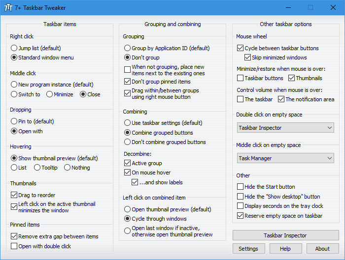
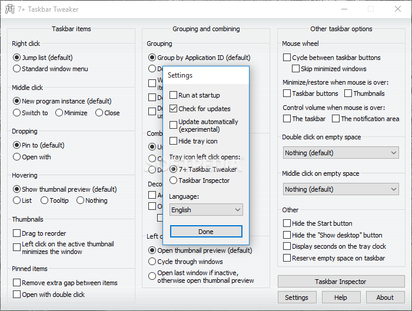
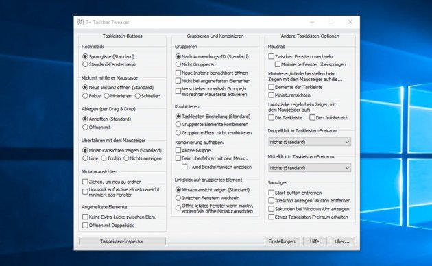

# 7+ Taskbar Tweaker

7+ Taskbar Tweaker is a free taskbar utility from Ramen Software. It changes mouse actions, grouping, thumbnails, jump lists, and the tray clock. Most of those switches are not in Taskbar properties and not in a registry checkbox.

7+ Taskbar is the short name people type. taskbar tweaker is the generic search. 7+ taskbar tweaker windows 10 is the current native host. 7+ taskbar tweaker windows 11 is not a native match: the vendor documents that the Windows 11 bar is unsupported.

## Links

Vendor pages: homepage, discussion, download, news. This pack is the handbook next to those pages, not a second site.

Homepage hosts the screenshot of the settings dialog. Discussion is the long thread. News is version notes. Download is the setup. Portable freeware indexes may list 7+ Taskbar Tweaker; they are mirrors, not the vendor.

The options list lives in [options_def.c](options_def.c). Portable or registry storage is [portable_settings.c](portable_settings.c). The GUI host starts in [exe.c](exe.c). Settings load and save sit in [options_load_save.c](exe/options_load_save.c).

Message IDs between the exe and the injected code are tweaker_messages.h. Version pins are version.h. The DLL export list is _exports.def.

## Technical details

7+ Taskbar Tweaker injects into Explorer and hooks the taskbar window. You pick an option in the settings dialog. The hook applies it to buttons, thumbnails, and the tray clock.

High level path:

| Step | What happens |
| --- | --- |
| 1 | The exe starts and reads options |
| 2 | A helper injects the DLL into Explorer |
| 3 | Hooks watch mouse, combine, and clock |
| 4 | You change a checkbox, the bar refreshes |

Injection is [explorer_inject.c](exe/explorer_inject.c). Mouse mapping is [mouse_button_control.c](dll/mouse_button_control.c). The low-level mouse hook is [mouse_hook.c](dll/mouse_hook.c). Taskbar window proc extras are [wnd_proc.c](dll/wnd_proc.c). A full redraw is [taskbar_refresh.c](dll/taskbar_refresh.c).

Hook helpers in this pack also sit in hook/hooking.h. Inspector tools for buttons are [taskbar_inspector.c](dll/taskbar_inspector.c).

Do not treat this as a theme pack. 7+ Taskbar Tweaker changes behavior, not acrylic color.

Injection must match Explorer bitness. A 64-bit bar needs the 64-bit DLL. The setup picks that. Mixing a 32-bit helper with a 64-bit Explorer looks like 7+ taskbar tweaker not working: the icon is there, the bar ignores clicks.

After a failed inject, open the advanced log if the build has one. Then restart Explorer from Task Manager, file name `explorer.exe`, and open the tweaker again.

Empty space on the bar can take a different mouse map than a button. The clock can take a third map. Set each row on purpose. A volume wheel on the clock does not move a grouped button.

Thumbnail live previews use more GPU than a static list. If the machine is a small laptop, disable previews first, then test grouping.

Jump lists on drag are separate from thumbnail hover. You can keep one and drop the other.

## Source code

This pack flattens the trees you can open next to the README.

- `exe/`: settings dialog, inject, option load
- `dll/`: mouse, volume, shortcuts, refresh
- `include/`: portable settings header
- `engine/`: inject and option helpers used in the pack
- `taskbar/`: extra taskbar samples
- `hook/`: hook and monitor samples
- `updates/`: update check samples

Settings dialog is [settings_dlg.c](exe/settings_dlg.c). The settings object is [settings.c](exe/settings.c). Extra option bits are options_ex.c under dll/. Keyboard shortcuts are [keyboard_shortcuts.c](dll/keyboard_shortcuts.c) in the same folder.

Engine start in this pack is main.cpp. Mod list helper is mods_manager.cpp under engine/. Process inject sample is new_process_injector.cpp there too.

A portable build writes INI next to the exe. An installed build can use the same option keys from [options_def.h](options_def.h).

Keep plugin-style extras out of the exe folder unless the vendor shipped them. Random DLLs next to the tweaker are not options.

If you compile from this pack, exe.c is the WinMain side and dll.c is the Explorer side. resource.h and rsrc.rc hold dialog templates. dllmain.c in FILES is a pack sample entry, not a second product.

Engine portable_settings.cpp is a second settings helper in the pack. include/portable_settings.h is the C header that matches portable_settings.c.

Do not commit a personal INI with machine paths. Option keys are enough.

## Additional resources

Mouse actions you can assign: cycle windows, close the program, volume up or down, show desktop, open a jump list. Targets: a taskbar button, empty space, the tray clock, thumbnail hover.

Volume on the clock or the bar uses [sndvol.c](dll/sndvol.c).

| Option group | Examples |
| --- | --- |
| Mouse | Middle click close, double click cycle, hover |
| Grouping | Never combine, ungroup icons, expand on hover |
| Thumbnails | Disable previews, change drag to jump list |
| Tray clock | Seconds on the clock |

7+ taskbar tweaker disable grouping, 7+ taskbar tweaker ungroup taskbar icons, and 7+ taskbar tweaker never combine taskbar buttons are the same family: you pick how buttons merge. 7+ taskbar tweaker middle click close is a mouse row. 7+ taskbar tweaker disable thumbnail previews is a thumbnail row. 7+ taskbar tweaker tray clock seconds is a clock row.

Never combine shows a button per window. Grouped combine stacks one icon and uses thumbnails or a list to pick a window. Hover-expand opens the group without a click. Closing a group can close every window in that AppId.

AppId lists live as appid_lists.c upstream. This pack keeps the mouse and refresh path instead. If one app still combines when the global rule says never, that app pinned with a custom AppId. Unpin, set the option, pin again.

Multi-monitor bars each get the hook. A setting is per user, not per display, unless the dialog says otherwise. Test the primary bar first.

7+ taskbar tweaker windows 7 grouping is the original target. The same dialog still drives 7+ taskbar tweaker windows 10. Labels vs icons-only is a Windows property. The tweaker sits on top of that property, it does not replace it.

## Uninstalling

Close 7+ Taskbar Tweaker from its tray icon. Use Apps and Features, or run the uninstaller from the vendor setup. A portable folder is delete-the-folder after you export options if you care.

Explorer may restart once when the DLL leaves. If a hook is still on, sign out and back in.

There is no leftover Start menu style to revert. This tool does not replace the Start menu.

## Updating

7+ Taskbar Tweaker can check for a new setup from the vendor. Update samples in this pack are [updates.cpp](updates/updates.cpp) and updates.h.

After a Windows patch, open the tweaker once. 7+ taskbar tweaker not working after a cumulative update usually means Explorer moved a structure the hook expects. Wait for a vendor build, or run the last setup again.

7+ taskbar tweaker windows 11 24h2 is outside the supported bar. The vendor says the Windows 11 taskbar is not a target and likely will not be. 7+ taskbar tweaker windows 7 and 7+ taskbar tweaker windows 10 stay the supported line.

Do not mix a new exe with an old injected DLL from another folder. One install, one hook.

Insider Explorer builds break hooks often. If 7+ taskbar tweaker not working the day after an insider flight, pause the flight or wait for a vendor note.

A second user on the same PC needs its own run. The hook is per session.

News posts on the vendor tag list versions such as 4.2 and later. Read the post before you skip a setup. A yanked build happens. Use the GET badge or the official download, not a random exe from a mirror.

## Donate

Ramen Software accepts support on the vendor site. 7+ Taskbar Tweaker stays free. Paying does not unlock a hidden combine mode.

FUNDING.yml in this pack is metadata, not a second donate product.

If you only needed never combine, you still got the full free dialog. There is no lite SKU. 7+ Taskbar and 7+ Taskbar Tweaker are one download.

Do not buy a random "pro tweaker" key on a third-party shop. This product has no key screen.

## Discord Server

Vendor discussion is on the Ramen Software thread for 7+ Taskbar Tweaker. Use that board for "not working" reports. Attach Windows version (7, 10, or 11), the tweaker version, and whether grouping or mouse failed.

This pack is not a chat server. Do not file a combine bug as a clock bug.

A useful report has: Windows build number, tweaker version from the about box, one option that fails, and whether a portable INI or an installed store was in use. A video of the bar is better than "it does not work".

YouTube clips linked in the brief are demos, not support. Watch them for mouse ideas, then set the same row in settings.

## Download

Use the GET badge for this pack. The vendor setup is 7tt_setup.exe from the Ramen Software download page.

Pick 7+ taskbar tweaker windows 10 for a native bar. On 7+ taskbar tweaker windows 11, read the vendor notice first: the stock Windows 11 bar is not supported. Older 11 builds that still host a 10-style bar may run; 24H2 usually does not.

Portable zip and setup exe are both 7+ Taskbar. Keep the folder writable if you use INI mode.

After install, open settings, set never combine or middle click close, and click a grouped app once. If nothing changes, Explorer did not take the DLL. Restart Explorer from the tweaker or from Task Manager.

build.yml, dll.c, dllmain.c, resource.h, and rsrc.rc are pack files. They are not a second installer.

Do not install two copies that both inject. One 7+ Taskbar Tweaker is enough.

Mirrors on download.it and similar are not this pack. Prefer the GET badge or the Ramen Software page.

Portable vs setup: portable keeps INI in the folder and is good for a USB test. Setup registers the run key so the hook returns after logon. For daily 7+ taskbar tweaker windows 10, setup is simpler.

If the tray icon is missing but options still apply, the icon hide is a Windows tray overflow, not a dead hook. Open the overflow and drag the icon back.

### Running

Start the exe. A tray icon stays while the hook is on. Right-click it for settings. Advanced options open from the same dialog (advanced_options_dlg in the upstream tree, not copied here).

Empty taskbar clicks, thumbnail drag, and clock hover use the mouse table in settings. Save, then hover the bar. No reboot.

Do not paste a machine-local loop address into a shortcut you pin for testing. Pin a real exe path.

First launch after setup can restart Explorer once. The desktop will flash. That is the inject, not a crash.

If you use a custom DPI per monitor, test the bar on each screen. A hook that works at 100% can miss a hit-test at 175%. Move the settings window to that screen and click Apply again.

Tablet mode can hide the bar. The tweaker does not fight tablet mode. Exit tablet mode, then test grouping.

Remote desktop uses the remote bar. Install 7+ Taskbar Tweaker on the session you actually click, not only on the client PC.

## Related Questions

**How to increase taskbar?**

Windows sets height from the bar properties (small buttons, show labels) and from display scale. 7+ Taskbar Tweaker does not grow the bar by pixels. It changes clicks, grouping, thumbnails, and the clock. For a taller bar on 7+ taskbar tweaker windows 10, use Windows taskbar settings first, then apply tweaker options.

**Can you still use Windows 7 in 2026?**

You can run the OS if you still have a machine, but it is out of support. 7+ taskbar tweaker windows 7 still matches that bar. For daily work, 7+ taskbar tweaker windows 10 is the safer host. This pack does not extend Windows 7 security updates.

**Is Translucent TB free?**

That name is a different utility. This page is 7+ Taskbar Tweaker, which is free. Transparency is not the job here. Use the GET badge for this tweaker, not a glass bar.

**How to change Windows taskbar to old style?**

On 7+ taskbar tweaker windows 10 you already have the classic combine model; set never combine and labels if you want the old look. On 7+ taskbar tweaker windows 11 the stock bar is the new one. 7+ Taskbar Tweaker does not restyle that bar. Use Windows settings or accept the vendor limit.

Old style here means labels, no combine, and a clock with seconds. It does not mean a Windows 7 skin on a Windows 11 bar. This tweaker is not a skin.

Taskbar10.cpp and TaskbarCenter.cpp under taskbar/ are pack samples for bar layout, not a Win11 theme switch.

Symbols and monitors in this pack: symbols.c and SettingsMonitor.c under hook/. Flyout sample is ImmersiveFlyouts.c under taskbar/. Logger sample is logger.cpp under engine/. Extra portable settings are portable_settings.cpp in engine/ and portable_settings.h in include/.

Session bits are session_metadata.cpp under engine/. Utility helpers are utility.c under hook/. Taskbar version pin is taskbar/version.h.

If 7+ taskbar tweaker not working on a fresh 10 install, run the setup as the same user who owns the bar, then open settings once.

7+ Taskbar and taskbar tweaker stay the same product on the news tag and the homepage.

Hooking.h is [hooking.h](hook/hooking.h). Utility helpers are already named above. If an option you want is not in the dialog, it is not a hidden INI key. The dialog is the full list from options_def.c.

A clean test: new local user, install 7+ Taskbar Tweaker, set never combine, open two Notepad windows. If they stay separate, grouping works. Then set middle click close and try a third window.

On a domain PC, a policy can lock the bar. The tweaker cannot override a policy that removes the bar. Check that first when a whole floor says 7+ taskbar tweaker not working.

Small buttons vs large buttons stay a Windows setting. Seconds on the clock stay a tweaker setting. Do not confuse the two when you write a report.

If Explorer crashes in a loop after a bad inject, start Windows in a clean session, rename the tweaker folder, then log on. File that crash with the version pair.

The pack does not ship a second taskbar exe. explorer.exe is still the bar. 7+ Taskbar Tweaker only hooks it.

About box version should match the setup you ran. If About is older than the file date, you have two copies. Uninstall both, then install once.

Clock seconds need the tray clock visible. If you hid the clock in Windows, the tweaker cannot show seconds on a hidden clock. Show the clock, then enable seconds.

Volume wheel needs a sound device. No device, no change. That is not 7+ taskbar tweaker not working.

Drag-to-jump-list needs a pin or a running AppId that has a jump list. A random portable exe may have an empty list. Test with a shell app first.

Inspector in taskbar_inspector.c is for debug of buttons. Daily users stay in the settings dialog.

engine/FUNDING.yml is a duplicate metadata file in the pack. Ignore it.

Logger.cpp under engine/ is a pack log helper. Turn it off for daily use if a build exposes a verbose flag.

When 7+ taskbar tweaker windows 11 is your only PC, read the vendor notice again before you open a ticket. The product is honest about the new bar. Tickets that say "make 24H2 work" repeat that notice.

A VM with a 10 bar is a valid test lab for 7+ taskbar tweaker windows 10. Snapshot before you inject. If Explorer loops, revert the snapshot.

Nightly Windows updates on Tuesday can break a hook. Wait a day, then check vendor news before you roll back the OS.

If you only need seconds on the clock and nothing else, you can leave grouping at the Windows default. The tweaker does not force every option on.

One option on is a valid setup. You do not have to fill every mouse row.

## Related Search Terms

7+ Taskbar Tweaker, 7+ Taskbar, 7+ taskbar tweaker windows 11, 7+ taskbar tweaker windows 10, taskbar tweaker, taskbar, windows, customization, windows-10, windows-11, explorer, tweaker, tray, hooking, desktop
